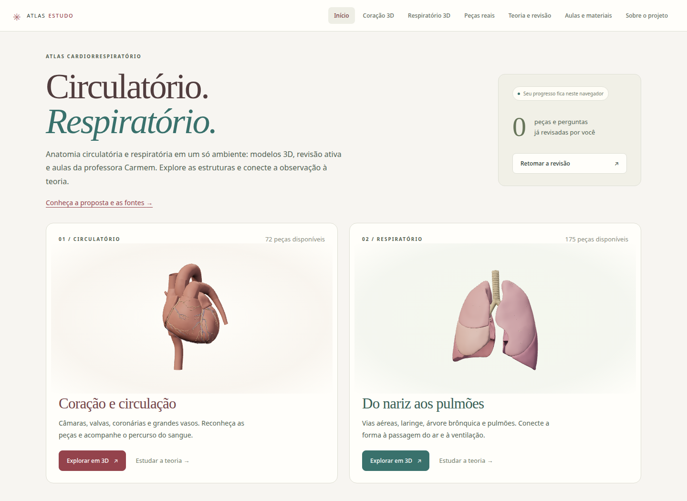

# Atlas cardiorrespiratório

Um ambiente de estudo de anatomia circulatória e respiratória que conecta modelos 3D, revisão ativa e material de aula. Desenvolvido por **Victor Hugo**, estudante de Medicina.

**[Abrir o atlas](https://ra149021.github.io/coracao-3d-estudos/)** · [Aulas e slides](https://ra149021.github.io/coracao-3d-estudos/classroom.html) · [Sobre o projeto e fontes](https://ra149021.github.io/coracao-3d-estudos/about.html)



## O que explorar

| Recurso | Uso no estudo |
| --- | --- |
| **Anatomia em 3D** | Coração e sistema respiratório, com seleção de estruturas, rotação, isolamento, transparência e cortes. |
| **Teoria e revisão** | 26 unidades e 94 questões originais, com referências e progresso salvo no navegador. |
| **Aulas da professora Carmem** | 7 aulas gravadas, busca nas transcrições e retomada do ponto de reprodução. |
| **Slides e roteiro** | 6 documentos e 354 páginas navegáveis, com acesso aos PDFs originais. |
| **Peças anatômicas reais** | 3 referências do Visible Heart Laboratories, Universidade de Minnesota, no visualizador oficial. |

## Uma sequência para conhecer o projeto

1. Abra o **Coração 3D**, selecione uma estrutura e experimente isolá-la.
2. Explore o **Respiratório 3D** e compare a disposição das peças.
3. Consulte uma unidade em **Teoria e revisão** e suas questões.
4. Abra **Aulas e materiais** para relacionar o estudo aos slides e às gravações.
5. Consulte **Sobre o projeto** para conhecer a proposta, as fontes e o escopo atual.

O site público funciona no navegador, sem instalação e sem depender dos arquivos do computador do autor. Modelos e bibliotecas estão no repositório; vídeos e PDFs estão no GitHub Releases. Os modelos 3D requerem WebGL 2; aulas e referências externas requerem conexão com a internet.

## Escopo e rigor

O material docente orienta o estudo. Os modelos têm simplificações e **não cobrem integralmente o roteiro**. A associação de um item a uma peça não certifica todos os detalhes anatômicos. O roteiro distingue peças associadas, contexto parcial e itens pendentes.

As transcrições são automáticas e servem para localizar trechos; os termos devem ser conferidos no áudio e nos slides. O progresso é pessoal, salvo apenas no navegador, e não mede domínio do conteúdo.

## Fontes e autoria

- **Geometria:** Z-Anatomy e BodyParts3D. Créditos, licenças e transformações em [NOTICE](site/LICENSES/NOTICE.txt).
- **Referência cardíaca independente:** Human Reference Atlas / HuBMAP, disponibilizada pelo NIH 3D, com [atribuição própria](site/assets/heart-hra/ATTRIBUTION.md).
- **Peças humanas:** Visible Heart Laboratories / Universidade de Minnesota, incorporadas do visualizador oficial; os arquivos dessas peças não são redistribuídos.
- **Material docente:** aulas, slides e roteiro da professora Carmem / UEM. Autoria preservada; esses materiais não integram as licenças das malhas. Os vídeos e PDFs ficam na [release de aulas](https://github.com/ra149021/coracao-3d-estudos/releases/tag/aulas-v1).
- **Teoria:** referências indicadas junto a cada unidade de estudo.

## Executar localmente

Requer Python 3 e navegador com WebGL 2. O site já inclui as dependências de execução.

```bash
python3 scripts/serve_heart.py --open
```

Acesse `http://127.0.0.1:8765` e mantenha o terminal aberto. Os arquivos docentes locais são opcionais: a biblioteca usa as cópias online quando não há acervo instalado.

## Código e verificações

| Local | Conteúdo |
| --- | --- |
| `site/` | Aplicação estática, modelos, índices e páginas de slides. |
| `scripts/` | Servidor local e preparação dos materiais. |
| `refinamento/` | Registros de geometria, fontes e cobertura. |
| [Revisão funcional final](VERIFICACAO_FINAL_SITE.md) | Correções de bugs, progresso, aulas e disponibilidade pública. |
| [Revisão de apresentação](VERIFICACAO_APRESENTACAO.md) | Conferências de navegação, leitura, modelos e layout móvel. |
| [Verificação das aulas](VERIFICACAO_AULAS.md) | Conferências de documentos, reprodução e navegação. |
| [Histórico técnico](docs/HISTORICO_TECNICO.md) | Evolução dos modelos, métodos e verificações anteriores. |

Alterações em `main` são publicadas pelo workflow **Publicar atlas**. Os vídeos e PDFs ficam fora do histórico Git, na release de aulas.

Correções de conteúdo, fontes ou navegação podem ser registradas nas [issues do projeto](https://github.com/ra149021/coracao-3d-estudos/issues), indicando a página, a estrutura e a referência pertinente.
